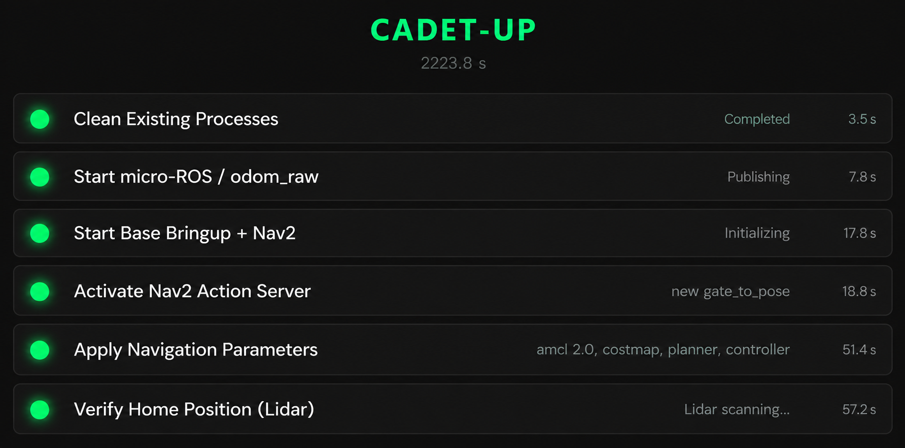
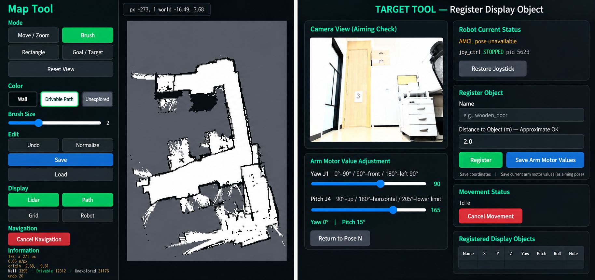

# CADET-UP: Docent Robot System

> **C**losed-loop **A**rchitecture for **D**ocent **E**xperience with **T**eleop & **U**nified **P**ipeline

A full-stack robotic docent platform for museum/indoor navigation, integrating voice commands, visual verification, and adaptive mobility control.

---

## 🤖 System Overview

**CADET-UP** is a museum docent robot built on the Yahboom ROSMASTER M3 platform, enhanced with:

- 🎤 **Voice-Commanded Navigation** — Real-time STT → NUL → Navigation pipeline
- 👁️ **Visual Verification** — Arm-mounted camera for post-execution arrival confirmation
- 🧠 **LLM-Driven Intelligence** — Cascade NLU (keyword → LLM interpretation)
- 📊 **Web Dashboard** — 12-stage boot health monitor + map editor + navigation viewer
- 🎮 **Joystick Teleoperation** — Manual control fallback

### 1. Auto Check-UP and Wake-Up system

### 2. Navigate tool

### 3. Voice via Move(Navi)

---

## 🎯 Key Features

### Voice-Commanded Navigation

### Visual Arrival Verification

### Real-Time Dashboard

### Hardware-Aware Design

## 📈 Performance Notes

| Metric | Value | Notes |
|--------|-------|-------|
| **E2E Latency** | ~800ms | Voice command → motion start |
| **Navigation Accuracy** | ±0.3m | With visual verification |
| **Battery Life** | ~4-6 hrs | Typical museum operation |
| **Max Speed** | 0.5 m/s | Safe indoor navigation |

## 📄 License

[Specify your license here — MIT, Apache 2.0, etc.]

